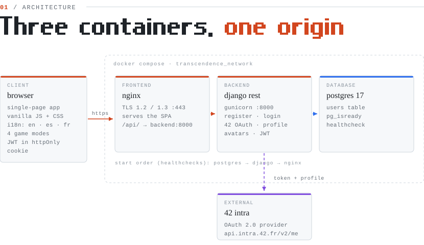
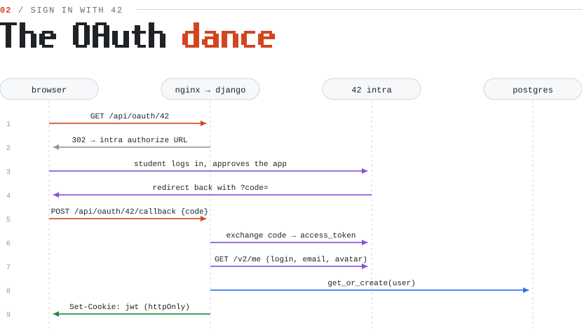
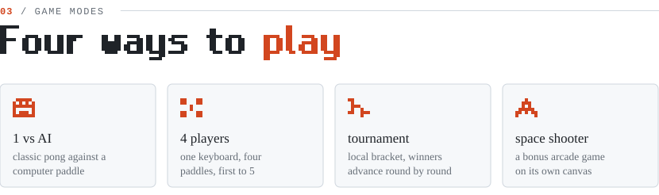

<picture>
  <source media="(prefers-color-scheme: dark)" srcset="docs/banner-dark.svg" />
  
</picture>

<picture>
  <source media="(prefers-color-scheme: dark)" srcset="docs/architecture-dark.svg" />
  
</picture>

<picture>
  <source media="(prefers-color-scheme: dark)" srcset="docs/oauth-dark.svg" />
  
</picture>

<picture>
  <source media="(prefers-color-scheme: dark)" srcset="docs/modes-dark.svg" />
  
</picture>

## Run it

```bash
# .env needs: POSTGRES_USER, POSTGRES_PASSWORD, POSTGRES_DB,
#             OAUTH42_CLIENT_ID, OAUTH42_CLIENT_SECRET, OAUTH42_REDIRECT_URI,
#             OAUTH42_AUTHORIZATION_URL, OAUTH42_TOKEN_URL
docker compose up --build
# then open https://localhost
```

<sub>Diagrams in <code>docs/</code> are generated SVGs, drawn to match the code in this repo.</sub>
